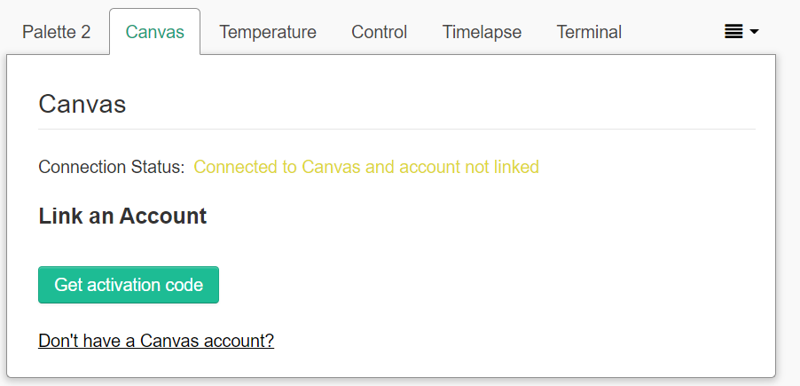
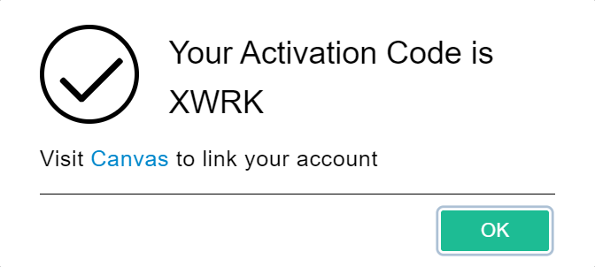
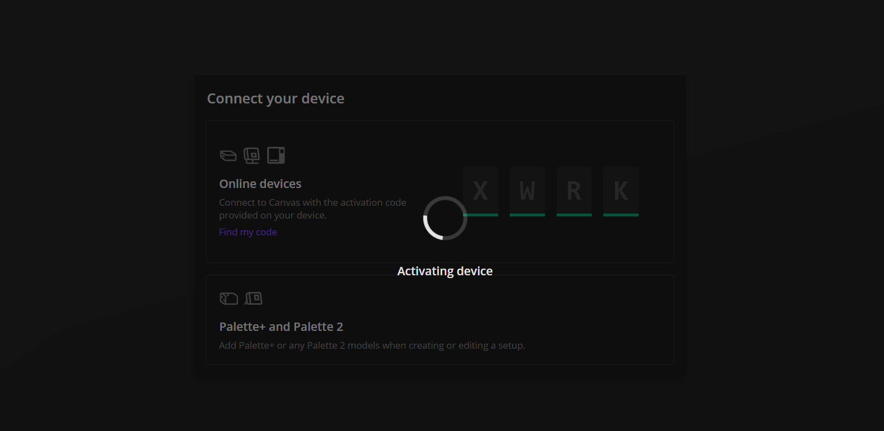
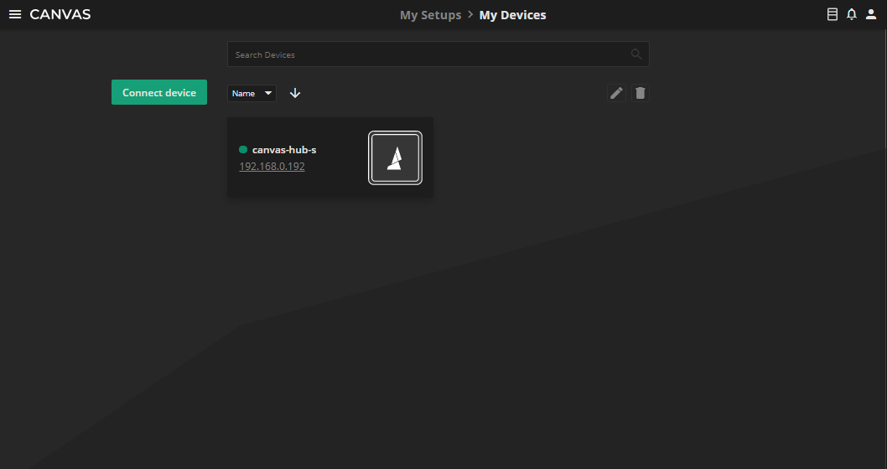
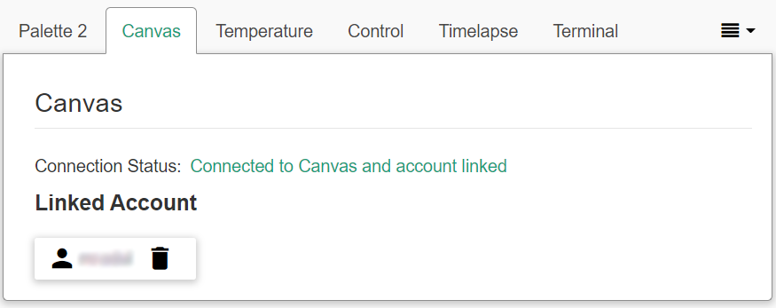
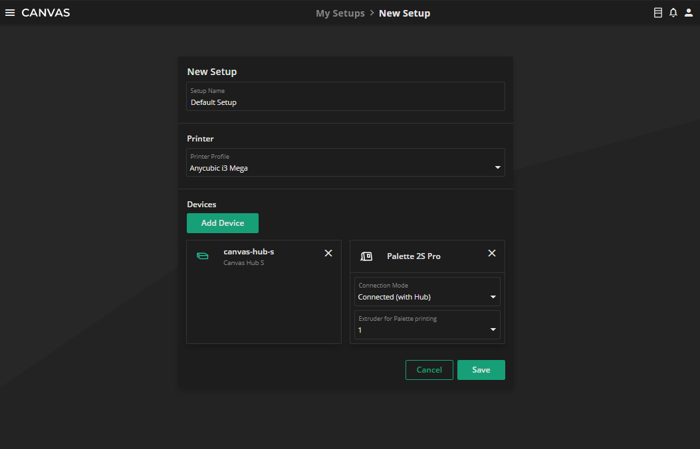
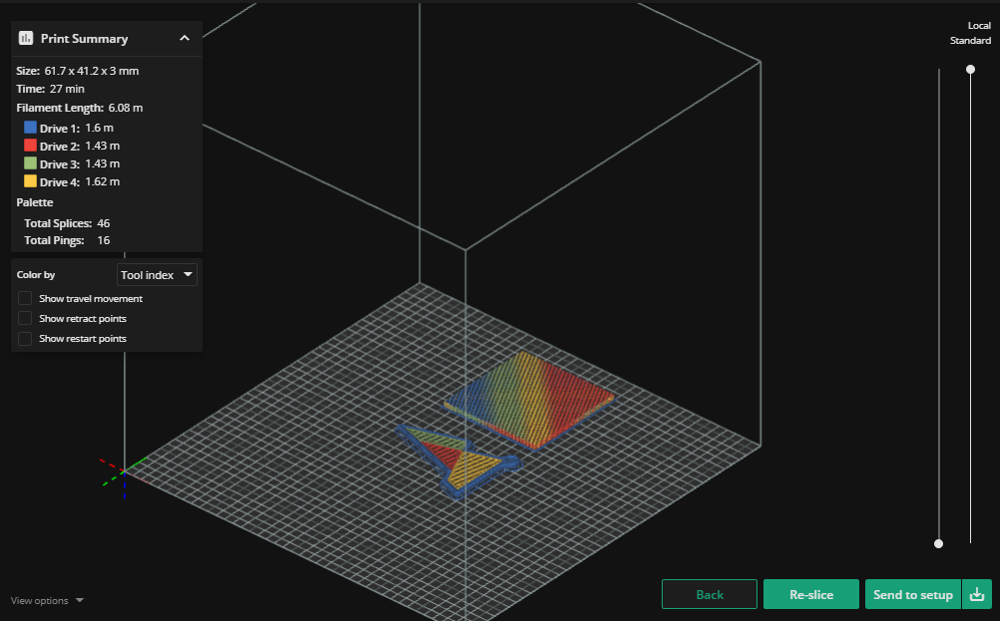

# CANVAS PLUGIN

This OctoPrint plugin enables connection and communication between OctoPrint and [Canvas](https://canvas3d.io/).

## Installing

On your OctoPrint server, manually install this plugin via the Plugin Manager using the following URL:

`https://gitlab.com/mosaic-mfg/canvas-plugin/-/archive/3.0.2/canvas-plugin-3.0.2.zip`

## Functionalities

### 1. Connect Canvas accounts to OctoPrint

#### 1.1. Go to Canvas tab

#### 1.2. Generate activation code

#### 1.3. Click on the Canvas link to activate device

#### 1.4. Look for the green light next to your device for a successful connection

#### 1.5. Congrats! You have successfully linked your Canvas Hub and Canvas

### 2. Add a Canvas Hub to your Canvas Setups

### 3. Send a sliced project to your 'Send to setup' button on the bottom right

## Authors
[Mosaic Manufacturing Ltd.](https://www.mosaicmfg.com/)

## License
This project is licensed under Creative Commons Public Licenses - see the [LICENSE](https://gitlab.com/mosaic-mfg/canvas-plugin/blob/master/LICENSE) file for more details.
